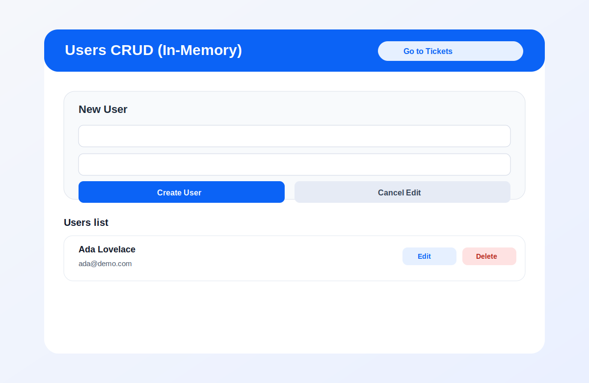
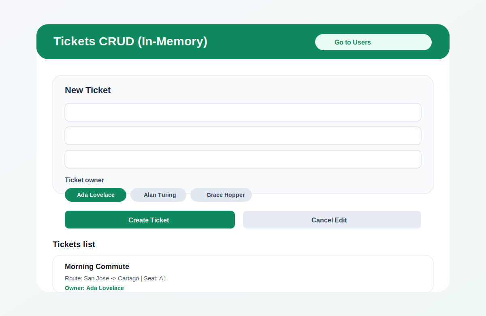

# Arquitectura del proyecto

Este proyecto usa una arquitectura modular por feature.
La idea principal es que cada modulo encapsule su logica y su UI, evitando dependencias innecesarias entre modulos.

Hoy la app tiene dos modulos funcionales:

- `users`
- `tickets`

La navegacion entre pantallas se maneja desde `src/navigation/AppNavigator.tsx` con React Navigation.

## Estructura general

```text
src/
  navigation/
  modules/
    users/
      components/
      constants/
      hooks/
      models/
      services/
      store/
      utils/
      views/
      index.ts
    tickets/
      components/
      constants/
      hooks/
      models/
      services/
      store/
      utils/
      views/
      index.ts
```

## Que contiene cada capa

- `models/`
  - Define tipos de negocio.
  - Define DTOs y mappers para separar la forma interna de la app de la forma externa de los datos.

- `services/`
  - Implementa acceso a datos.
  - En este proyecto hay servicios en memoria para usuarios y tickets.

- `store/`
  - Maneja el estado del modulo.
  - Expone provider y hooks para leer/escribir estado.

- `hooks/`
  - Orquesta casos de uso del frontend.
  - Ejemplos: crear usuario, editar ticket, eliminar ticket, cargar listas.

- `components/`
  - Componentes UI reutilizables dentro del modulo.
  - Ejemplo: formulario y lista.

- `views/`
  - Pantallas completas.
  - Componen componentes + hooks para renderizar la funcionalidad final.

- `constants/`
  - Mensajes, codigos de error y literales del modulo.

- `utils/`
  - Utilidades del modulo, como validaciones.

- `index.ts`
  - Punto de entrada publico del modulo.
  - Centraliza exports y evita imports profundos.

## Imagenes de referencia

### Users



### Tickets



## Flujo de datos (resumen)

1. La vista invoca acciones del hook.
2. El hook valida y llama al service.
3. El service responde con DTO.
4. El mapper convierte DTO a modelo de app.
5. El hook actualiza el store.
6. La vista se re-renderiza con el nuevo estado.
7. Si hace falta cambiar de pantalla, la vista usa el stack navigator.

## Reglas recomendadas

- Evitar importar archivos internos de otro modulo directamente.
- Importar solo desde el `index.ts` del modulo.
- Para navegar entre pantallas, usar `src/navigation/AppNavigator.tsx`.
- Si algo es realmente compartido, moverlo a `shared/`.
- Mantener tipado fuerte en modelos, props y casos de uso.

## Ventajas de esta arquitectura

- Escala mejor cuando crecen pantallas y equipo.
- Reduce acoplamiento entre funcionalidades.
- Facilita testing por capas.
- Hace mas claro donde debe vivir cada tipo de logica.
